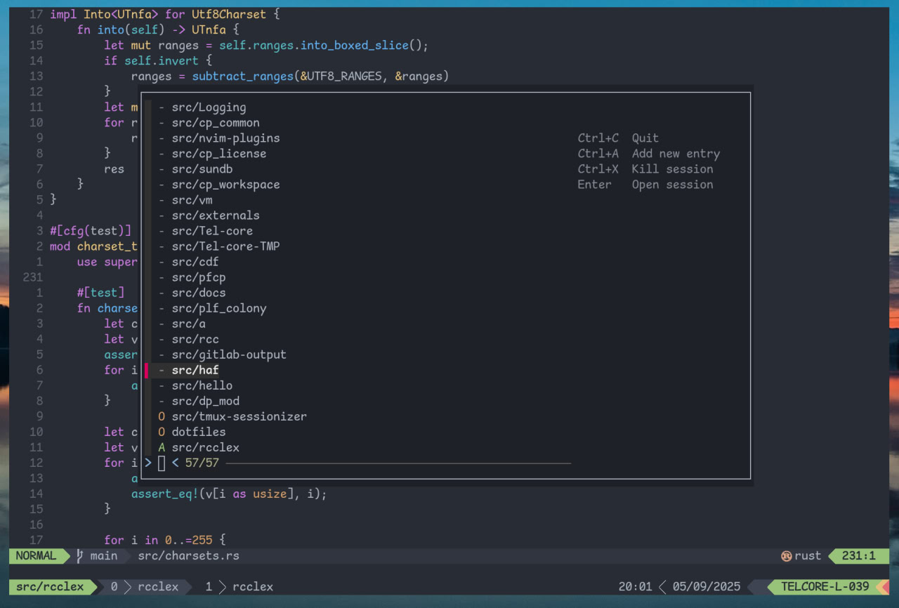

# tmux sessionizer

Navigate through tmux sessions, create/open/kill tmux sessions



## Requirements

- [fzf](https://github.com/junegunn/fzf)
- [tmux](https://github.com/tmux/tmux)

## Configuration

Example of configuration file (stored at `$HOME/.config/tmux-sessionizer/sessions`)

```
~/src/*:src/%
~/tmp/*:tmp/%
~/.dotfiles:dotfiles
```

Format of each line is `pattern:name`, where `pattern` is a **glob pattern** to match directories, that correspond with sessions named `name`.

- For each `pattern`, `~` is expanded to `$HOME`
- For each `name`, `%` is expanded to basename of directory, specified by `pattern`

## Usage

See `tmux-sessionizer --help` or look for help menu

### Integration with tmux

Nice way to use tmux-sessionizer is through binding key to open tmux popup, for example:

```
# at $HOME/.config/tmux/tmux.conf
bind-key j display-popup -w 70% -h 70% -E "<path to tmux-sessionizer>"
```
